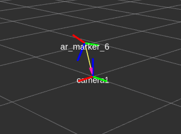
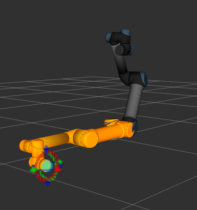
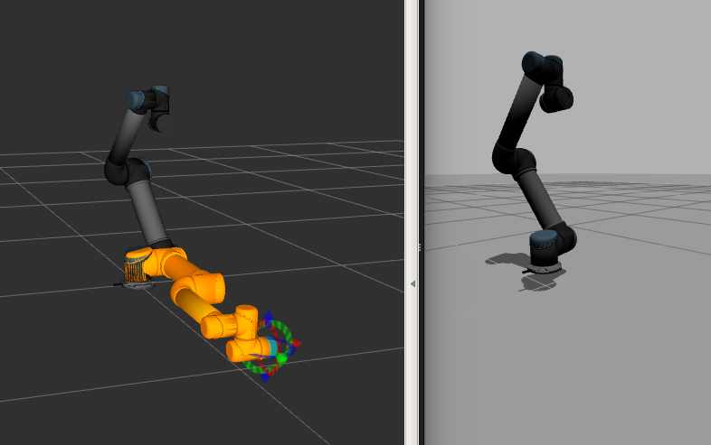

# IMT-350 Robotics II - 2017 Shadow motion using alvar tag
### This project was done by: Oscar Vasquez
### The professor of the subject was Benjamin Pinaya
==========================
####This project shows how we can generate movement to a ur5 robot using a figure of alvar tag 

==============================================
##### We can see a visualization of alvar tag in rviz

====================
##### Also we have an image of the ur5 inrviz

======================
######### Finally we have rviz and gazibo implementation

[I'm an inline-style link](https://www.youtube.com/watch?v=nkP3A7bOTHU)